# Linear Regression for Bike Sharing Analysis
This project uses linear regression to predict bike-sharing demand based on various environmental and temporal factors. The goal is to build a model that can forecast the number of bikes rented per hour, based on features such as weather conditions, temperature, humidity, day of the week, and time of day.

# Key Features:
- Data analysis and preprocessing of the bike-sharing dataset
- Exploration of key factors affecting bike demand (e.g., temperature, weather, holidays, etc.)
- Implementation of linear regression to model bike rental demand
- Evaluation of model performance using metrics like Mean Squared Error (MSE) and R²

# Dataset:
The dataset contains information on bike rentals per hour, including features like weather, time, temperature, humidity, and other factors influencing demand.
Technologies Used:
- Python
- Pandas
- NumPy
- Matplotlib & Seaborn (for data visualization)
- Scikit-learn (for machine learning)

# Assignment-based Subjective Questions

## 1. From your analysis of the categorical variables from the dataset, what could you infer about their effect on the dependent variable?

In the real-life practical use-cases, categorical variables play important role of their influence on dependent variable. In current study, various categorical variables found to be major influence for dependent variable.

Few important categorical variables from use-case are:
### Session:
‘season’ has good influence on target variable with highest in fall season and least in spring season.
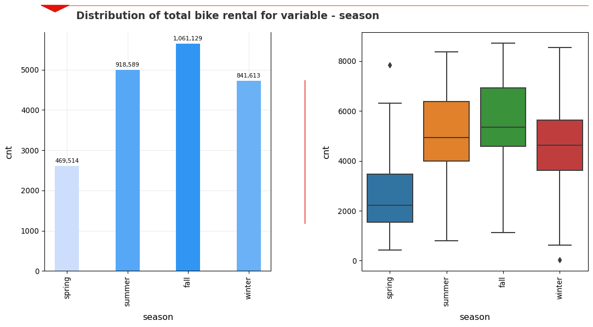

### Session:
Year by year, there is huge growth in bike rentals.
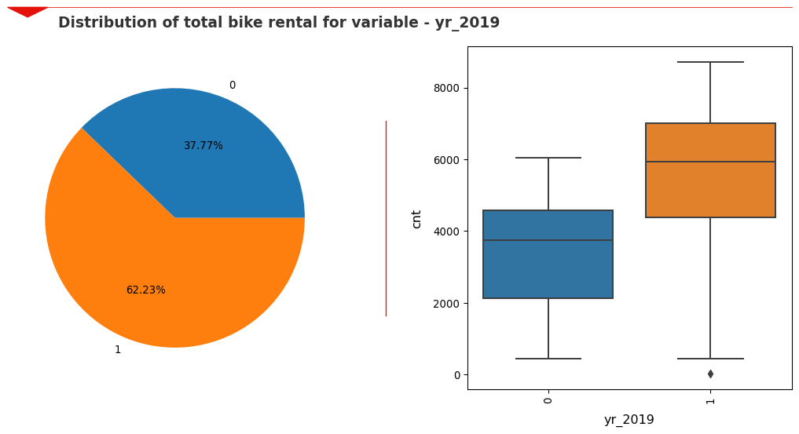

### Month
It is found that many of months between March to October, are having high drivability of number of bike rentals.
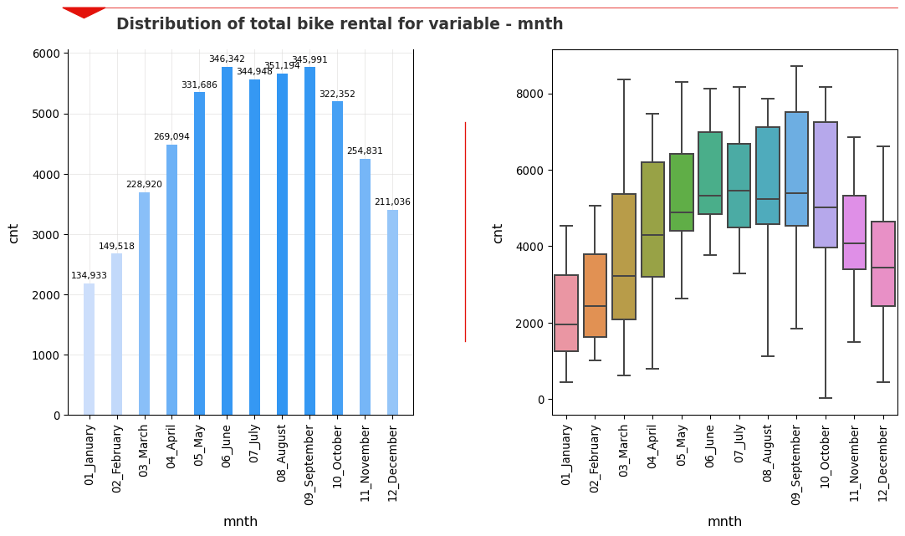

### Holiday
It is found that flag ‘holiday’ has high drivability of number of bike rentals.
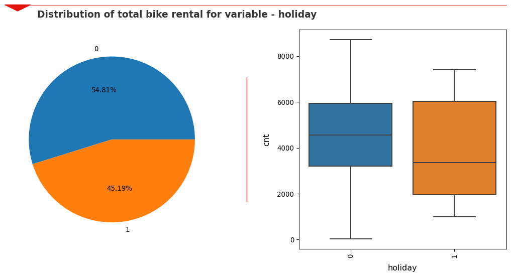

### Weekday
It is found that flag ‘weekday’ has less drivability on number of bike rentals.
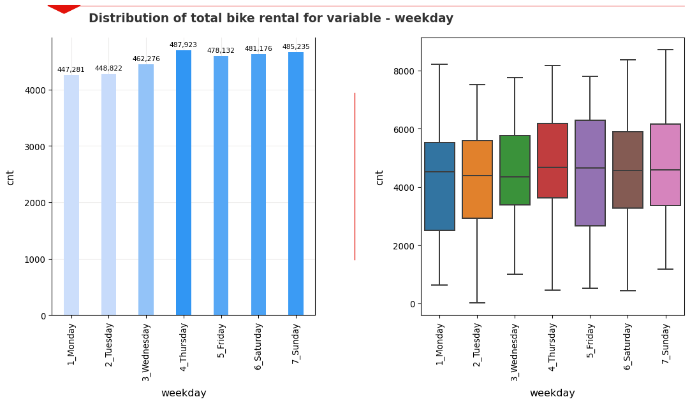

### Weathersit
It is found that Light_Snow_or_Rain (indicates Light Snow, Light Rain + Thunderstorm + Scattered clouds, Light Rain + Scattered clouds) and Mist_Clouds (indicates Mist + Cloudy, Mist + Broken clouds, Mist + Few clouds, Mist) are having high drivability of number of bike rentals.
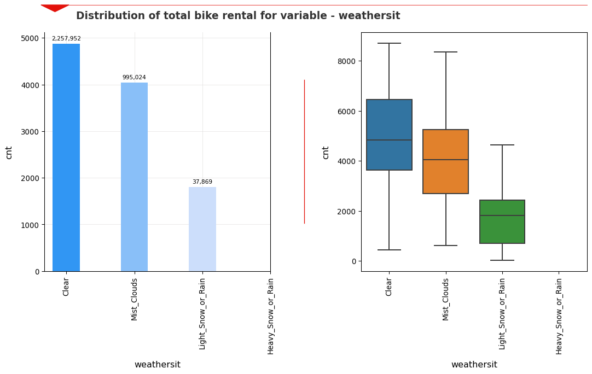

As linear regression model only take number as input for find the relation of independent variable with dependent variable, these categorical variables are first converted to dummy variables using ‘One Hot Encoding’. Sometimes if number of categories are high in categorical variable, then it may result in vary high number of independent variables for creation of model. Ideally number of dependent variables should be reduced to between 7 to 15, to achieve this, techniques like manual or automatic feature selection are needed.

## 2. Why is it important to use drop_first=True during dummy variable creation?
While creating dummy variables it is important to use drop_first=True, to avoid ‘perfect multicollinearity’ within the dataset, which means one of dummy variable is perfectly derivable from other dummy variables generated.

As the categorical variable with ‘n’ categories will create ‘n’ dummy variables where for each row only one of ‘n’ dummy variable will contain 1 and all other dummy variables will contain 0 based on value of categorical variable, therefore any of these categorical variables can be defined as absence of all other ‘n-1’ categorical variables, make it completely derivable and hence generate ‘perfect multicollinearity’. By using drop_first=True, multicollinearity due to such cases is avoided.

For example, two define a ‘gender’ column with two values ‘male’ and ‘female’, only one dummy variable ‘male’ is sufficient with value ‘1’ for male and ‘0’ for female.

## 3. Looking at the pair-plot among the numerical variables, which one has the highest correlation with the target variable?
Looking at the pair-plot among the numerical variables, variables ‘temp’ and ‘atemp’ have highest correlation with the target variable. ‘temp’ and ‘atemp’ both are equally correlation with the target variable and very high correlation to each other (with correlation coefficient (Pearson’s R) of 0.99, hence one of two (i.e. ‘temp’) is removed to avoid multicollinearity, leaving ‘atemp’ has highest correlation with the target variable.
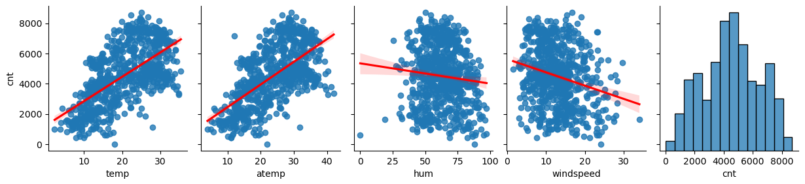

## 4. How did you validate the assumptions of Linear Regression after building the model on the training set?

Validation of Linear Regression:

- **Linear relation between independent variable with dependent variable:**
  - Regression line on pair plot for independent variables with dependent variable shows linear relation among them fulfilling the assumption.
- **Multicollinearity**
  - As all the independent variables in final model has VIF less than 5, it is safe to conclude that there is no multicollinearity among independent variables.
- **Normal distribution of error terms:**
  - error_terms are calculated by getting the difference between actual y_train and predicted y_train. A distribution plot and probability plot of error terms shows:
    - Normal distribution of error terms
    - Mean of error terms is Zero.
  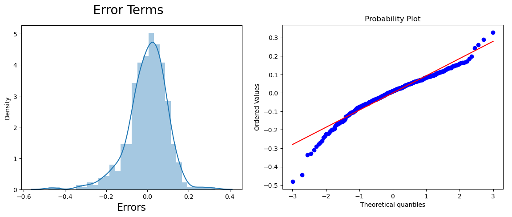
- **Homoscedasticity of the error terms**
  - A y_test vs y_test_pred scatterplot and regression plot, shows even variance of error terms along regression line.
  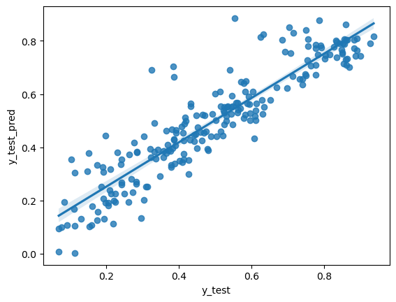

## 5. Based on the final model, which are the top 3 features contributing significantly towards explaining the demand of the shared bikes?
Based on the final model, the top 3 features contributing significantly towards explaining the demand of the shared bikes are:
- ‘atemp’ with explaining dependent variable by factor 0.5652.
- ‘weathersit_Light_Snow_or_Rain’ with negative (reverse) effect on dependent variable by factor of 0.2813.
- ‘yr_2019’ with explaining dependent variable by factor 0.2390.

# General Subjective Questions

## 1. Explain the linear regression algorithm in detail.
Linear regression algorithm a machine learning algorithm used for prediction and forecasting of dependent continuous variable. It helps in determine the linear correlation between one or more independent variables and the dependent variable. Linear correlation is defined by following equation: -
  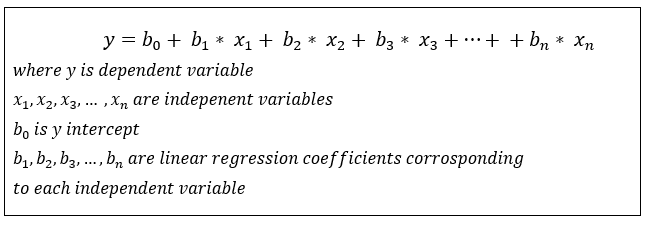

**Important features/steps involved in Linear Regression algorithm are:**
- If there is single independent variable the linear regression, then it is known as ‘Simple Linear Regression’, and if there are multiple independent variables to determine dependent variable, then it is known as ‘Multiple Linear Regression’.
- Algorithm aims to draw best fit line/plane to the various datapoints by minimizing ‘mean square error (MSE)’ or ‘ordinary least squares (OLS)’ as cost function.
- Optimizing methods that can be used to minimize cost function are:
  - Closed form solution (This is done by directly put ∂ J(θ) / ∂θ = 0 and solve the equation. This method is good for simpler cases, however as degree of equation increases difficult to solve.)
  - Iterative form solution (Helps in finding local minima)
    - First Order Method (Gradient Decent):
      - This is most commonly used method that try to find local minima iteratively through slowly moving toward it by amount which is controlled by learning rate.
    - Second Order Method (Newton’s Method)
- Libraries like sklearn and statsmodels are commonly used for linear regression in Python

**Important assumptions that need to be fulfilled for any linear regression model:**
- Linear relation between independent variable and dependent variable.
- No multicollinearity: change in any one independent variable shouldn’t affect the value of another independent variable.
- Normal distribution of error terms in the model.
- Homoscedasticity of the error terms: the variance is the same across all values of the independent variables.

## 2. Explain the Anscombe’s quartet in detail.
Anscombe’s Quartet is great example to demonstrate the importance of ‘Data Visualization’ and effect of outliers on statistical interpretations. The Quartet contains four dataset that have identical descriptive statistic values like means, variance, R-Squared, correlations, and linear regression lines. However, all four datasets have completely different data distribution. The datasets were created by the statistician Francis Anscombe in 1973 and is as follows:

|                             | **I**     | **II**    | **III**   | **IV**    |
| --------------------------- | --------- | --------- | --------- | --------- |
| **_x_**                     | **_y_**   | **_x_**   | **_y_**   | **_x_**   | **_y_** | **_x_** | **_y_** |
| Dataset                     | 10        | 8.04      | 10        | 9.14      | 10 | 7.46 | 8 | 6.58 |
| 8                           | 6.95      | 8         | 8.14      | 8         | 6.77 | 8 | 5.76 |
| 13                          | 7.58      | 13        | 8.74      | 13        | 12.74 | 8 | 7.71 |
| 9                           | 8.81      | 9         | 8.77      | 9         | 7.11 | 8 | 8.84 |
| 11                          | 8.33      | 11        | 9.26      | 11        | 7.81 | 8 | 8.47 |
| 14                          | 9.96      | 14        | 8.1       | 14        | 8.84 | 8 | 7.04 |
| 6                           | 7.24      | 6         | 6.13      | 6         | 6.08 | 8 | 5.25 |
| 4                           | 4.26      | 4         | 3.1       | 4         | 5.39 | 19 | 12.5 |
| 12                          | 10.84     | 12        | 9.13      | 12        | 8.15 | 8 | 5.56 |
| 7                           | 4.82      | 7         | 7.26      | 7         | 6.42 | 8 | 7.91 |
| 5                           | 5.68      | 5         | 4.74      | 5         | 5.73 | 8 | 6.89 |
| Mean                        | **9**     | **7.501** | **9**     | **7.501** | **9** | **7.500** | **9** | **7.501** |
| Sample Variance             | **11**    | **4.127** | **11**    | **4.128** | **11** | **4.123** | **11** | **4.123** |
| Correlation between x and y | **0.816** | **0.816** | **0.816** | **0.817** |
| Linear regression slope     | **0.500** | **0.500** | **0.500** | **0.500** |
| Linear regression intercept | **3.000** | **3.001** | **3.002** | **3.002** |
| R^2                         | **0.667** | **0.666** | **0.666** | **0.667** |

Although statistical values are very close (or similar) to each other, actual data distribution of each set is very different, and which is very easily understandable in data visualization (Dataset 1 has linear relation, Dataset 2 has polynomial relation, Dataset 3 and Dataset 4 observe huge deviation in linear relation due to single outlier):
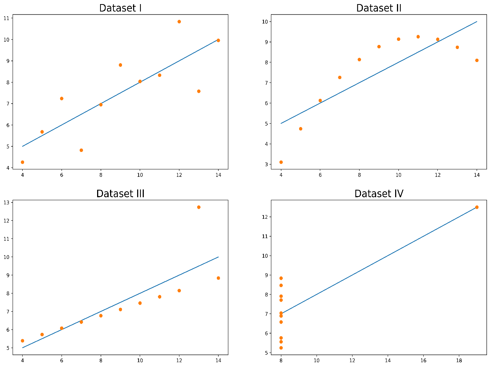

From above Anscombe’s Quartet following things are concluded:
- The importance of using data visualization to spot any abnormality like outliers etc.
- The importance of exploratory data analysis to explore the trends that are not clear from statistical values.

## 3. What is Pearson’s R?
Pearson’s R, which is also refer as Pearson correlation coefficient shows the relationship type and its magnitude between different continuous variables based on sample dataset. The range of Pearson’s R varies from -1 to 1, where magnitude 0 to 1 indicates how strong two variables are correlated. Here value near 0 indicates very less correlation and high magnitude near 1 indicates strong correlation. And sign (+/-) indicates the direction of change, where +vs indicates with increase in one variable there will be increase in value of other variable and -ve indicates with increase in one variable, value for other variable will decrease. Calculation of Pearson’s R is defined by formula:
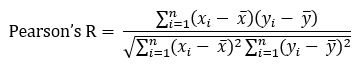

**Important properties or limitations of Pearson’s R:**
- Pearson’s R determines only linear relationship between two variables. The variables that are perfectly polynomial relation may observe lower coefficient value.
- Pearson’s R determines correlation and no causation, which means it can determine relation between two variables, but cannot determine change in which will affect other (i.e. it cannot tell which is independent and dependent variable).
- Pearson’s R doesn’t provide information about the slope of relation; however, sign of Pearson’s R and slope of relationship will always be same.
- Pearson’s R (correlation coefficient) is sensitive to outliers. It is good indicator if the relation between continuous variables is linear, normally distributed and has no outlier.

## 4. What is scaling? Why is scaling performed? What is the difference between normalized scaling and standardized scaling?
Scaling is the process of normalization of values of independent continuous variable within a particular range. It creates different variables on same range, so that these ranges become similar to that of other variables.

**Importance of scaling:**
- Variable scaling is important for machine learning models like linear regression model, as due to larger ranges model give more importance to few variables, which can lead to inaccuracy of results.
- Scaling helps in speeding up the calculations in the algorithm.
- If sample data contains huge variation in ranges of different variables, it sometimes may lead to overfitting or underfitting of model, resulting in poor results.

**Difference between normalized scaling and standardized scaling:**
| **Normalized Scaling**                                                                                     | **Standardized Scaling**                                                                                   |
| ---------------------------------------------------------------------------------------------------------- | ---------------------------------------------------------------------------------------------------------- |
| Also known as min-max scaling                                                                              | also known as z-score normalization                                                                        |
| Range is between 0 and 1                                                                                   | Range is between -1 and 1                                                                                  |
| Formula used for scaling  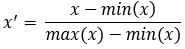 | Formula used for scaling  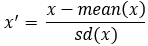 |
| It is more useful for models like logistic regression or support vector machine.                           | It is more useful for models like linear regression.                                                       |

## 5. You might have observed that sometimes the value of VIF is infinite. Why does this happen?
VIF is defined by formula: 
VIF = 1/(1- R^2) 

In case R-square between two variable is 1, then VIF will be infinite. Infinite VIF indicates “perfect correlation of variable with one or more independent variables”. This means that two variables are orthogonal.

**Problem with presence of Orthogonal variables:**
If orthogonal variables will present in dataset than this may lead to inconsistency in result of machine learning algorithm like linear regression. For instance, while finding optimal cost, coefficients of independent variables will never settle to a fixed point. If a linear relation like y = b1 \* x1 + b2 \* x2 to be found than value of b1 and b2 become dependent of each other due to orthogonal property, this make difficult for machine learning algorithm to decide optimal coefficient values.

**How to handle high VIF and orthogonal variables:**
- Eliminate variable through exploratory data analysis (EDA).
- Perform Principal Component Analysis (PCA) to determine the optimal set of principal components and performing modeling of them.
- Sometimes increasing sample size helps in handling multicollinearity.
- Transforming data to different space using log etc.

## 6. What is a Q-Q plot? Explain the use and importance of a Q-Q plot in linear regression.
Quantile-Quantile Plot (Q-Q plot) is a graphical method that compares two probability distributions by plotting scatter plot of their quantiles against each other. Many times Q-Q is used to compare plot of single continuous variable’s probability distribution against probability distribution of some standard distribution (like normal distribution) to verify whether particular variable follows particular distribution.

If both probability distributions follow the same pattern, then a line y = x (passing through (0, 0) and making a angle of 45 degree with x and y axis.

**Advantages/Importance of Q-Q plot:**
- Q-Q plot is useful in determining following for two datasets:
  - If their populations have common distribution.
  - If they have common location and scale.
  - If they have similar distributional shapes.
  - if tail behavior similar for two datasets.
- Local features like repetition of identical numbers, gaps etc. are easily identifiable.
- Presence of light or heavy tail, right or left skewness is clearly indicated.
- As Q-Q plot compares the probability distributions, the size of two quantitative variables can be different.
- Presence of outliers and any deviation/exception are easily visible in Q-Q plot.

# Important Link
- [Linear Regression Subjective Questions](./Linear_Regression_Subjective_Questions_Kunal.pdf)
